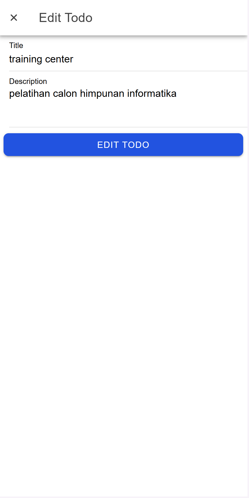

# Tugas 10 - Pertemuan 11 - Proyek Ionic

**Nama:** Muhammad Levi Asshidiqi  
**NIM:** H1D022103  
**Shift Baru:** A  

# CRUD `firestore.ts`

1. Create (addTodo): Menambahkan todo baru ke Firestore. Fungsi ini menggunakan addDoc untuk menambahkan dokumen baru ke koleksi todos yang berada di dalam koleksi users dengan UID pengguna yang sedang login. Status todo diset ke false saat pembuatan, dan createdAt serta updatedAt diset menggunakan Timestamp.now().

2. Read (getTodos): Mengambil daftar todo yang sudah disortir berdasarkan updatedAt dengan urutan menurun (descending). Fungsi ini menggunakan getDocs dan query dengan filter orderBy untuk mengambil dokumen-dokumen dari koleksi todos.

3. Update (updateTodo dan updateStatus): Fungsi updateTodo memperbarui informasi todo berdasarkan id. Fungsi ini mengubah nilai dari todo dan memperbarui updatedAt. Sedangkan updateStatus hanya memperbarui status todo (seperti menyelesaikan todo atau tidak).

4. Delete (deleteTodo): Menghapus todo berdasarkan id menggunakan deleteDoc.

tahapan singkat untuk membangun APK menggunakan Capacitor di proyek Ionic:

1. npm install @capacitor/core: Instal pustaka inti Capacitor.

2. npm install @capacitor/android: Instal plugin Android untuk Capacitor.

3. ionic build: Membangun aplikasi web (frontend) untuk proyek Ionic.

4. ionic capacitor add android: Menambahkan platform Android ke proyek Ionic.

5. ionic capacitor sync: Menyinkronkan proyek dengan platform Android.

6. gradlew assembleDebug: Membangun APK dalam mode debug untuk pengujian.

7. gradlew assembleRelease: Membangun APK dalam mode release untuk distribusi.

# Tugas 9 Pertemuan 10 - Proyek Ionic

Masukkan SS ke dalam Readme.md lalu jelaskan SS dibawah setiap gambar. 

Jelaskan bagaimana cara dari mulai autentikasi login, hingga aplikasi mendapatkan username dan profil kita dari akun google.

# Inisialisasi Firebase `firebase.ts`

1. Konfigurasi Firebase: Menghubungkan aplikasi dengan proyek Firebase menggunakan `firebaseConfig`.

2. Inisialisasi Authentication: Menginisialisasi layanan autentikasi Firebase menggunakan `getAuth`.

3. Provider GoogleAuth: Membuat instance dari `GoogleAuthProvider` untuk memungkinkan autentikasi dengan akun Google.

# Autentikasi `auth.ts`

1. Variabel `user`: Menyimpan informasi pengguna yang login.

2. Computed Property `isAuth`: Mengecek apakah pengguna sudah login atau belum (bernilai true jika user tidak kosong).

3. Fungsi `loginWithGoogle`: Mengatur proses login dengan Google. Langkah-langkahnya:

- Inisialisasi GoogleAuth: Menggunakan plugin @codetrix-studio/capacitor-google-auth untuk autentikasi Google di perangkat seluler.
- Proses Sign-In: Melakukan autentikasi Google dengan memanggil GoogleAuth.signIn(), yang mengembalikan ID token pengguna.
- Konversi Token ke Credential: Menggunakan GoogleAuthProvider.credential(idToken) untuk membuat kredensial Firebase dari ID token.
- Autentikasi Firebase: Menggunakan signInWithCredential untuk login ke Firebase dengan kredensial Google.
- Penyimpanan Data Pengguna: Menyimpan data pengguna ke variabel user dan mengarahkan pengguna ke halaman /home.
- Error Handling: Menampilkan alert jika login gagal.

4. Fungsi logout: Melakukan logout dengan memanggil signOut dari Firebase dan GoogleAuth.signOut(), lalu menghapus data pengguna dan mengarahkan ke halaman login.

5. Status Autentikasi dengan onAuthStateChanged: Firebase mendeteksi perubahan status login pengguna dan memperbarui variabel user setiap kali ada perubahan.

# Autentikasi `router/index.ts`

1. Akses Halaman Terproteksi: Setelah login, pengguna dapat mengakses halaman seperti /home dan /profile.

2. Konfigurasi Rute: Menyusun rute untuk login (/login)

3. konfigurasi beranda (/home)

4. konfigurasi profil (/profile).

